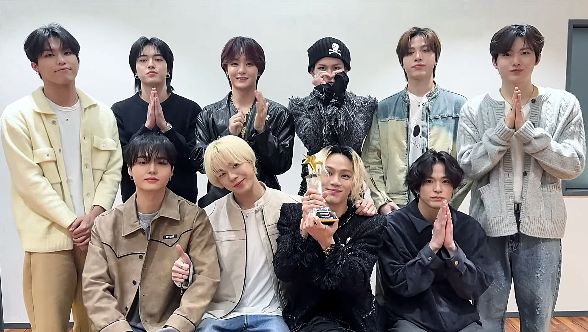

# 💎 TREASURE Profile

A fan-community platform built with **Python & Streamlit**, featuring member profiles, Spotify-integrated discography, birthday alerts, favorites, and a community cheer board — all backed by real-time data from Google Sheets.

🔗 **Live demo:** [treasure-profile-2025.vercel.app](https://treasure-profile-2025.vercel.app)



---

## ✨ Features

- 👤 **Member profiles** — browse individual member info and details
- 🎵 **Spotify-integrated discography** — explore music releases tied to each member/group
- 🎂 **Birthday alerts** — never miss a member's birthday
- ⭐ **Favorites** — mark and keep track of favorite members
- 📣 **Community cheer board** — a space for fans to leave messages of support
- 🌙 **Dark-mode, responsive grid UI** with custom CSS animations
- 🔄 **Real-time data updates** via the Google Sheets API (gspread)

---

## 🛠️ Tech Stack

| Layer          | Technology |
|----------------|------------|
| Framework      | Python + Streamlit |
| Data Source    | Google Sheets API (gspread) |
| Styling        | Custom CSS (dark mode, animations) |
| Deployment     | Vercel |

---

## 🚀 Getting Started

### Prerequisites
- Python 3.9+
- A Google Cloud service account with access to the Google Sheets API (for `gspread`)

### Installation

```bash
# Clone the repository
git clone https://github.com/NichakamonB/treasure-profile-2025.git
cd treasure-profile-2025

# (Optional) create and activate a virtual environment
python -m venv venv
source venv/bin/activate   # on Windows: venv\Scripts\activate

# Install dependencies
pip install -r requirements.txt
```

### Google Sheets setup

1. Create a Google Cloud service account and download its JSON credentials.
2. Share your Google Sheet with the service account's email address.
3. Add your credentials to the project (e.g. as a `credentials.json` file or environment variable), and reference them from `index.py`.

### Run the app

```bash
streamlit run index.py
```

The app should now be running at `http://localhost:8501`.

---

## 📁 Project Structure

```
treasure-profile-2025/
├── images/              # UI assets
├── group.jpg            # Group photo used in the app
├── treasure_group.jpg   # Group photo used in the app
├── index.py             # Main Streamlit application
├── requirements.txt      # Python dependencies
└── pyvenv.cfg
```

---

## 📄 License

This project is open source. Feel free to explore, fork, and adapt it for your own use.

---

## 👤 Author

**Nichakamon Buaphan**
- GitHub: [@NichakamonB](https://github.com/NichakamonB)
- LinkedIn: [nichakamon-buaphan](https://linkedin.com/in/nichakamon-buaphan)
- Portfolio: [nichakamon-resume.netlify.app](https://nichakamon-resume.netlify.app)
